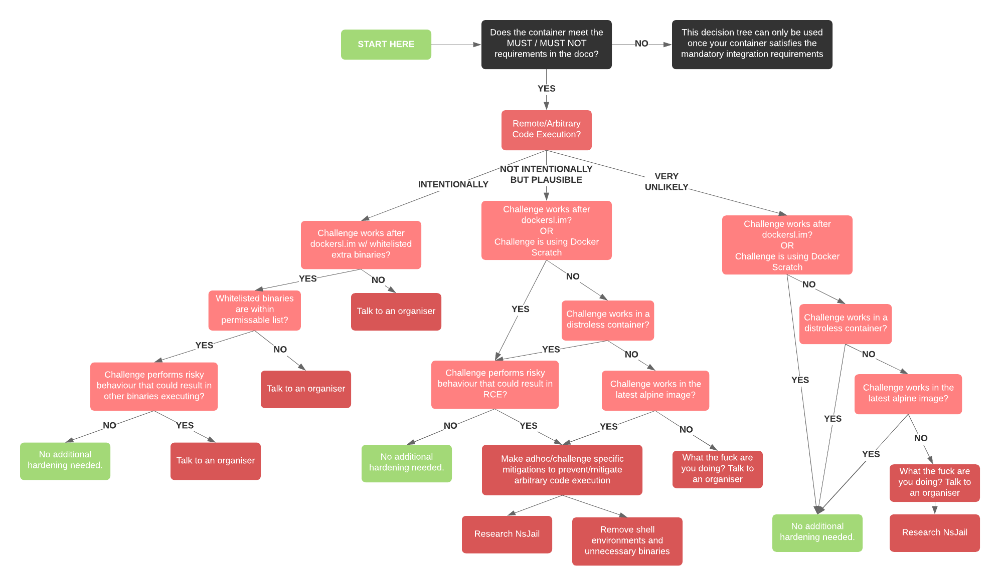

# Setting up for development

**I’ll start with the bad news.**

gVisor isn’t supported in Docker for Windows or Mac. The good news is we have provided a `setup.sh` script (and a Vagrantfile) in the `Automation` directory that will spin up a suitable Ubuntu testing VM for you. As gVisor is a drop-in replacement for runC, you _should_ be safe to do all your development in a different environment and perform your integration tests in the VM. We are using Ubuntu 18.04 for the following setup.

**Prod version of Docker:**

Use the latest patch level of Docker CE version `19.03` (at the time of writing `19.03.11`). Follow the [Docker instructions](https://docs.docker.com/engine/installation/linux/ubuntu/) (or refer to the `setup.sh` script in the `Automation` directory).

**Prod version of gVisor**

Use the latest patch level of gVisor version `2020` (at the time of writing `20200522`). Follow the `Install from an apt repository` [instructions here](https://gvisor.dev/docs/user_guide/install/) (or refer to the `setup.sh` script in the `Automation` directory).

After installing gVisor, you'll need to run `sudo runsc install` which will complete the Docker quickstart install.

**Set gVisor as the default runtime**

Add `"default-runtime": "runsc"` to `/etc/docker/daemon.json` and restart docker `sudo systemctl restart docker`. `daemon.json` should look like this:

```
{
  "runtimes": {
    "runsc": {
      "path": "/usr/bin/runsc"
    }
  },
  "default-runtime": "runsc"
}
```

**Prod version of docker-compose:**

Use version `1.26.0`. You can get the correct version of docker-compose by running the following:
```
sudo curl -L "https://github.com/docker/compose/releases/download/1.26.0/docker-compose-$(uname -s)-$(uname -m)" -o /usr/local/bin/docker-compose
sudo chmod +x /usr/local/bin/docker-compose
```

**Important note**

Get these major and minor versions of Docker/docker-compose/gVisor to ensure that your challenge(s) will work as expected in the game environment. Other versions of Docker _may_ work, but don't be that guy/girl.

**I've never used Docker before though :/**

We have provided some sample Dockerfiles in the `Example-Dockerfiles` directory to help get you started. Be mindful though that they might not meet the container hardening requirements listed below. They are a good starting point though.

Now here's some handy commands that will make your docker-dev life better:

|Command|What it does|
|---|---|
| docker-compose up | This starts the Docker containers specified in the [docker-compose](docker-compose.yml) file |
| docker-compose up -d | This does the same as above, but launches in daemon mode so you don't have the "How do I exit VIM???" problem |
| docker-compose stop | This will stop the Docker containers |
| docker-compose rm | This removes the containers, you will want to do this if you are devving things (you won't have to download the base images again) |
| docker-compose build | This will re-build the Docker containers (if you make a change, rm then do this) |

## Autonomy

Your challenge(s) are expected to work out-of-the-box. A game organiser should only need to run `docker-compose up` and your Dockerfile/docker-compose file should execute any startup scripts necessary to bring the challenge to its fully working state.

## Port Ranges

In previous years, WACTF had port ranges for challenges. In K8-land, this is no longer a requirement. Your challenge should run on a non-privileged port (that’s `>1024`) or use the canonical port if the service you are running has one i.e a webserver on port 80. As a side note, there’s no requirement for encryption in transit (like TLS / HTTPS), teams will be encapsulated in their own OpenVPN stream, so avoid this unnecessary complexity.

## Flag Format

The flag format is: `WACTF{FLAG_OF_YOUR_CHOICE}` (obviously nothing that could be considered generally offensive). For challenges that players may be able to `strings` (or similar) the flag when you don't want them to, you can specify your own flag format, ensure this is well documented in the challenge documentation provided with your deliverable.

# Environment & Container Hardening Requirements

There are enforced container restrictions for workloads in our K8 environment. Your challenge container must meet these requirements, or it will not integrate.

Your container:

1. MUST work in the [gVisor](https://gvisor.dev/) runtime
2. MUST use a hardended base image. Guidance on using [dockersl.im](https://dockersl.im) and [Distroless Containers](https://github.com/GoogleContainerTools/distroless) is below, Docker Scratch is also accepted. `alpine:latest` is supported if all else fails but may require additional application hardening (refer to the decision tree below)
3. MUST NOT run as `root` unless for binding to ports and then dropping privileges (such as Apache/nginx)
4. MUST NOT require any unsupported `docker-compose` keys (such as volume mounts). If you use the supplied `docker-compose` file you will be fine, you can check [here](https://kompose.io/conversion/) for compatibility
5. MUST NOT internationally permit players to gain `root` privileges on the container
6. MUST NOT require additional Linux capabilities (such as `NET_ADMIN` or `--privileged` mode)

Use the hardening decision tree below to determine whether there are any additional measures you need to perform for your challenge.

## Hardening Decision Tree


[Bigger image](hardening-decision-tree.png)

## Using dockersl.im or distroless containers


blah

## Permissable whitelisted binaries

If your container is getting shelled, the developer should consider the interactions necessary for the player to get the flag and for the environment to still feel real. This isn’t intended to be an exhaustive list of permitted binaries, rather a list to draw inspiration from.

```
sh / bash / ash
whoami
pwd
cd
ls
cat
```

# What Now?

See: [README-Delivery.md](README-Delivery.md)
