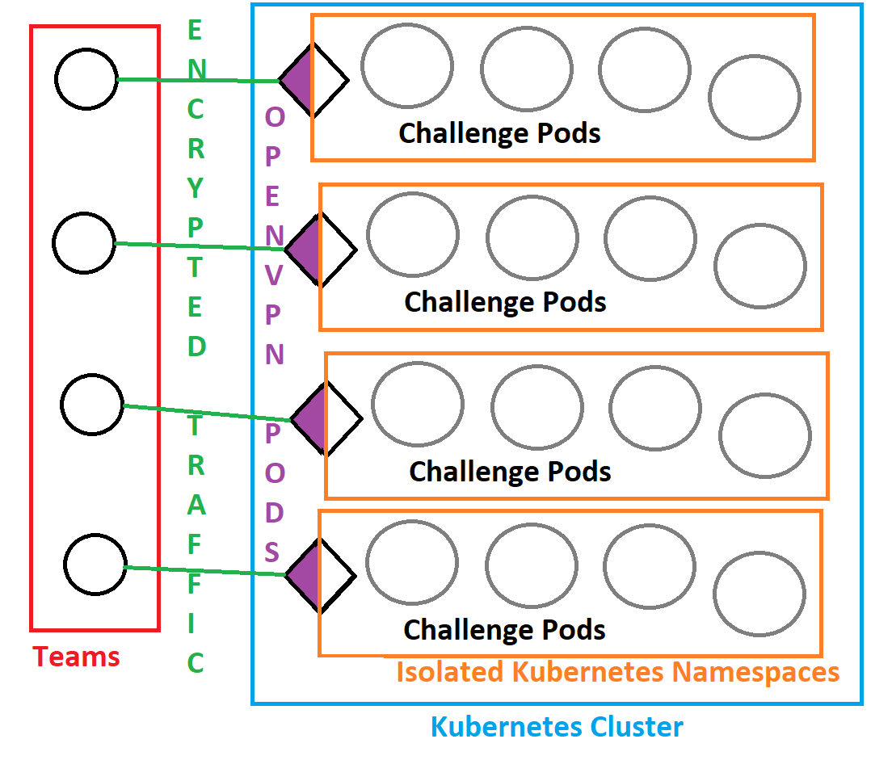

# Hello CTF Builder!

This is some important documentation on how to build your challenge(s) so they work in harmony with others in the production Kubernetes & Docker environment.

## TODO
-	Complete instructions on dockersl.im / distroless containers
-	Update hardening decision tree based on dockersl.im findings
-	Complete `setup.sh` to install dockersl.im
-	Complete instructions on pushing containers to the registry
-	Update example Dockerfiles to be aligned with hardening requirements

## Overview of the WACTF tech stack

At a high level, WACTF is a collection of Docker containers replicated across “namespaces” in a Kubernetes (K8) cluster. Each team is provisioned a namespace containing the challenges and support containers. Support containers include an OpenVPN container for teams to connect to their namespace, and a simple shellbox they can SSH to for accepting connections/reverse-shells. In K8-land containers are referred to as “pods” – to get a little technical, one pod can hold numerous containers but in WACTF’s case it’s 1:1 so we use "pods" and "containers" interchangeably.

Each namespace has various security/firewall policies applied to isolate it from other team’s namespaces and internal resources (such as the metadata API’s of most cloud providers). Pods within a namespace can speak to one another and also to a DNS server. We use DNS to address challenges as (by default) K8 un-deterministically allocates internal IP addresses to pods. Each pod also has resource constraints and logging/monitoring capabilities.

Players connect to their team’s environment via an OpenVPN pod within their namespace which is the only pod that has external networking capabilities. Put it all together and you get something that looks a little like this work of art:

Kubernetes is a hairy beast and it wouldn’t be fair to require challenge developers to understand how it works before being able to contribute. That’s why we have chosen Docker as our container platform. As long as you follow the requirements detailed in this repository you won't need to worry about the blood sacrifice required for it to work in Kubernetes.

You can (if you want) continue reading about the WACTF infrastucture in the [README-Infra.md](README-Infra.md).

## Challenge difficulty

We've all played CTFs where the challenges have been super edge case or confusing and have left us frustrated. WACTF hopes to bring an element of realism into the CTF by modeling challenges from scenarios that aren't so far fetched. If you have a CTF idea that involves `z-base-32 encoded hex strings` it's unlikely going to be a good fit for WACTF. Some other things to keep in mind:

- Avoid challenges that require extensive port scanning or directory brute-forcing - if your challenge requires this make sure it's mentioned in the game description, or provide the expected output of `nmap` or `dirb` to the player
- Your container won't have Internet access once it's running
- The game will run over 2 days, ~8 hours a day
- Unless you're developing `Misc` category challenges, avoid building in unnecessary rabbit holes and red herrings, focus on realism
- You must perform all your own quality assurance before telling the organisers you’re done. Challenge authors who deliver broken challenges will be referred to the firing squad

The tier of challenge you're developing correspond to the level of difficulty it's expected to be. As we have a defined scope for the players of this CTF we have provided some guidance to the level of difficulty below:

| Tier | Expected Difficulty|
|----|----|
|1| Solvable by anyone with a decent level of problem solving skill. Google seaching should lead to solves |
|2| Solvable by those with limited cyber security skill, such as early Comp Sci / Cyber Sec University / TAFE students or people who have attempted CTF's (such as Pico) before |
|3| Solvable by students close to completing higher education (or recent graduates) who may have participated in CTFs or have taken other cyber security training before |
|4| Solvable by people in techincal streams within the cyber security industry |

## What now?

Go read the [README-Setup.md](README-Setup.md) file, then the [docker-compose](docker-compose.yml) file, then the `Dockerfile`'s in the [Example-Dockerfiles](Example-Dockerfiles) directory, and lastly the [README-Challenge.md](README-Challenge.md) and [README-Challenge-Example.md](README-Challenge-Example.md) files.

